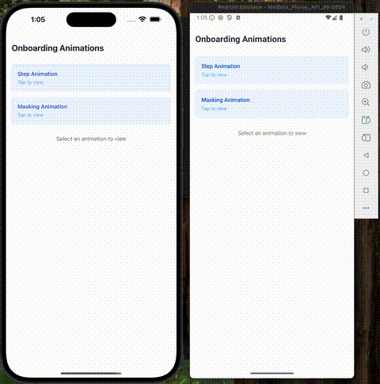

# Reanimated Onboarding

A beautiful, interactive onboarding experience built with React Native Reanimated 3 and Expo. This project showcases smooth animations, gesture handling, and a delightful user onboarding flow.

## Features

- 🎨 Smooth, buttery animations powered by React Native Reanimated 3
- ✨ Interactive onboarding slides with parallax effects
- 📱 Responsive design that works on both iOS and Android
- 🎯 Built with TypeScript for type safety
- 🎨 Styled with Tailwind CSS using NativeWind
- 🚀 Optimized performance with React Native Gesture Handler
- 🎭 Beautiful Lottie animations integration

## Demo

[](https://github.com/AhsanT4riq/reanimated-onboarding/raw/main/demo/demo.mov)

_The GIF above shows a preview of the app. Click on it to view the full demo video (`demo.mov`)._

## Tech Stack

- [Expo](https://expo.dev/) - Development platform
- [React Native Reanimated](https://docs.swmansion.com/react-native-reanimated/) - For smooth animations
- [React Native Gesture Handler](https://docs.swmansion.com/react-native-gesture-handler/) - For gesture handling
- [NativeWind](https://www.nativewind.dev/) - Utility-first CSS framework
- [Lottie](https://airbnb.design/lottie/) - For beautiful animations
- [TypeScript](https://www.typescriptlang.org/) - For type safety

## Prerequisites

- Node.js (v16 or later)
- Bun (https://bun.sh/)
- Expo CLI (`bun install -g expo-cli` or `npm install -g expo-cli`)
- iOS Simulator (for iOS development) or Android Studio (for Android development)

## Installation

1. Clone the repository:

   ```bash
   git clone https://github.com/yourusername/reanimated-onboarding.git
   cd reanimated-onboarding
   ```

2. Install dependencies:

   ```bash
   bun install
   ```

3. Start the development server:

   ```bash
   bun expo start
   ```

4. Run on your device/emulator:
   - Press `i` for iOS simulator
   - Press `a` for Android emulator
   - Scan the QR code with Expo Go app on your physical device

## Project Structure

```
.
├── src/                  # Source code
│   ├── app/              # Main application screens and navigation (Expo Router)
│   ├── assets/           # Static assets (images, fonts, etc.)
│   ├── components/       # Reusable UI components
│   ├── data/             # Static data, mock data, or slide configurations
│   └── utils/            # Utility functions and helpers
```

## Available Scripts

- `bun start` - Start the Expo development server.
- `bun run android` - Build and run the app on a connected Android device or emulator.
- `bun run ios` - Build and run the app on an iOS simulator (add `-d` to choose a specific device).

## Contributing

Contributions are welcome! Please follow these steps:

1. Fork the repository
2. Create your feature branch (`git checkout -b feature/AmazingFeature`)
3. Commit your changes (`git commit -m 'Add some AmazingFeature'`)
4. Push to the branch (`git push origin feature/AmazingFeature`)
5. Open a Pull Request

## Learn more

To learn more about developing your project with Expo, look at the following resources:

- [Expo documentation](https://docs.expo.dev/): Learn fundamentals, or go into advanced topics with our [guides](https://docs.expo.dev/guides).
- [Learn Expo tutorial](https://docs.expo.dev/tutorial/introduction/): Follow a step-by-step tutorial where you'll create a project that runs on Android, iOS, and the web.

## Join the community

Join our community of developers creating universal apps.

- [Expo on GitHub](https://github.com/expo/expo): View our open source platform and contribute.
- [Discord community](https://chat.expo.dev): Chat with Expo users and ask questions.

## License

This project is licensed under the MIT License - see the [LICENSE](LICENSE) file for details.
